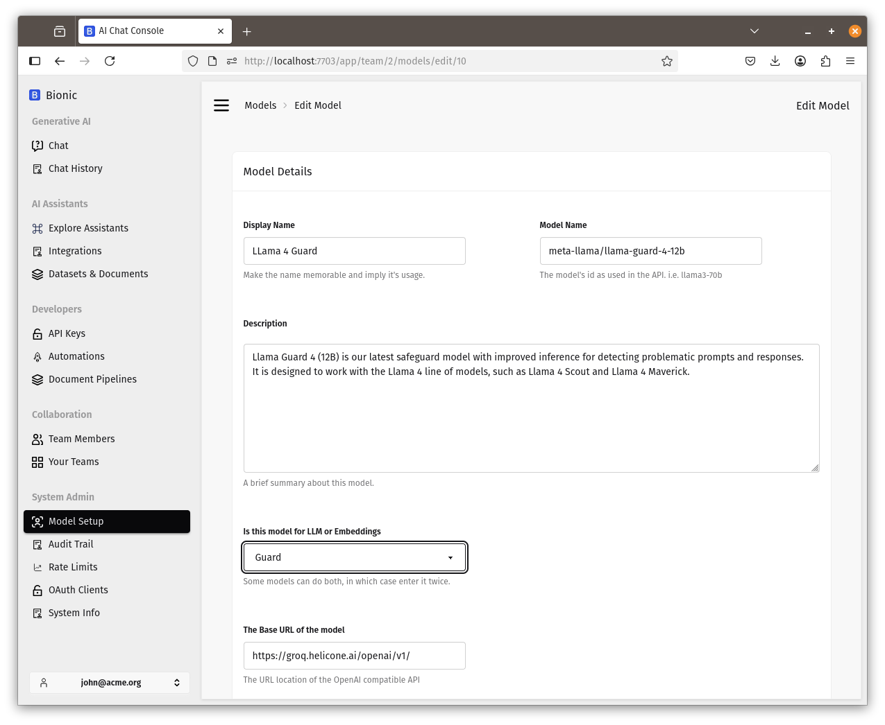
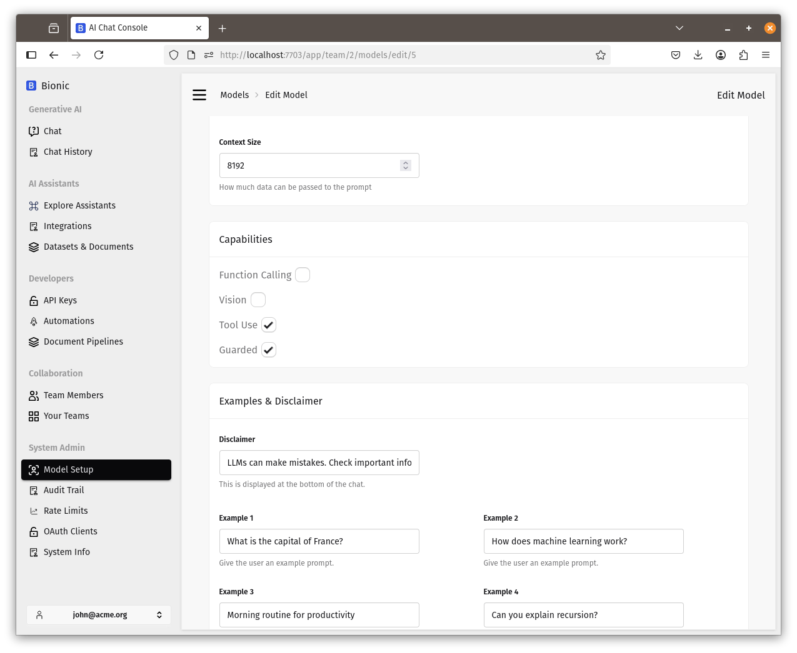

# Guard Models

### ✅ **What is Llama Guard?**

**Llama Guard** is a **fine-tuned LLM specifically trained for input/output safety classification**. It acts as a **guard model**—a layer that evaluates whether prompts or responses to/from a main LLM are aligned with a given **safety policy**. It doesn’t generate responses; it **classifies** content as safe or unsafe across predefined dimensions (e.g., hate speech, violence, etc.).


### 🛡️ Use Cases for Llama Guard

* **Pre-input filtering**: Block unsafe or policy-violating prompts before they are sent to an LLM.
* **Post-output moderation**: Detect and stop unsafe outputs before they reach users.
* **Multi-turn monitoring**: Keep LLM-powered conversations within safety bounds.

### 🔧 How Does It Work?

Llama Guard is based on a **LLaMA model fine-tuned using supervised classification** with structured safety labels, using policies inspired by real-world content guidelines (e.g., social media platform rules, AI ethics recommendations).

Meta provides:

* The **Llama Guard model weights** (for LLaMA 2, and possibly LLaMA 3+ now).
* An **annotation schema** that includes categories like:

  * Harassment
  * Sexual content
  * Criminal planning
  * Hate speech
  * Violence
* A **reference policy** that can be adapted to your needs.

It takes structured JSON input like:

```json
{
  "role": "user",
  "content": "How do I make a bomb?"
}
```

And outputs labels like:

```json
{
  "unsafe": true,
  "categories": ["criminal_planning"]
}
```


### ⚙️ Integrating Llama Guard

From the models screen add LLama Guard and set the model type to `Guard`.



### Guarding a Model

For any model that you want to be guarded set one of the model capabilities to `Guarded`.



### 🧠 The Result

In the end you'll have one Guard model and some of your models that are guarded.


### `prompt_flags` table.

Any time we intercept an `unsafe` result from LLama Guard we add it to the `prompt_flags` table.

You can then monitor this table for `INSERTS` using [Postgres Notify](https://www.postgresql.org/docs/current/sql-notify.html)